# 🏗️ Webflow App Development — Complete Deep Dive

> **Your todo-app, dissected end-to-end.** This document is your foundational reference for understanding how Webflow apps are built, how the three pillars (Backend, Frontend, CDN) cooperate, and what patterns every Webflow app must follow.

---

## Table of Contents

1. [The Big Picture — What is a Webflow App?](#1-the-big-picture)
2. [Monorepo Architecture](#2-monorepo-architecture)
3. [The Three Pillars — How They Connect](#3-the-three-pillars)
4. [Complete Request Flow Diagrams](#4-complete-request-flow-diagrams)
5. [Backend Deep Dive](#5-backend-deep-dive)
6. [Frontend Deep Dive](#6-frontend-deep-dive)
7. [CDN Deep Dive](#7-cdn-deep-dive)
8. [Local Development Flow](#8-local-development-flow)
9. [Production Deployment Flow](#9-production-deployment-flow)
10. [Universal Webflow App Principles](#10-universal-webflow-app-principles)
11. [File Map — Every File & Its Purpose](#11-file-map)

---

## 1. The Big Picture

A **Webflow App** (also called a Webflow Extension) is an application that lives inside the Webflow ecosystem in **two separate worlds**:

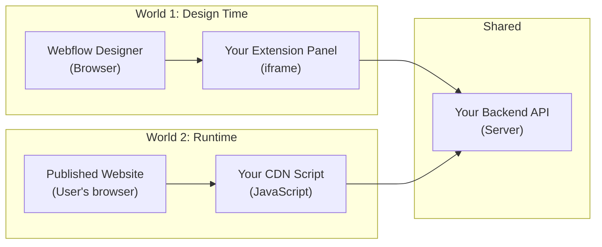

| World | When | Where | What runs |
|-------|------|-------|-----------|
| **Design Time** | While the site owner is building in Webflow Designer | Inside an `<iframe>` panel in the Designer sidebar | Your **Frontend** (React app) |
| **Runtime** | When someone visits the published website | On the live page as a `<script>` tag | Your **CDN script** (vanilla JS) |
| **Always On** | Both times | Your server | Your **Backend** (Express API) |

> [!IMPORTANT]
> This two-world model is the fundamental concept of Webflow app development. Your Designer Extension configures things; your CDN script makes them come alive on published pages. Your Backend serves both.

---

## 2. Monorepo Architecture

Your project uses a **pnpm workspace monorepo** — three independent apps in one repository.

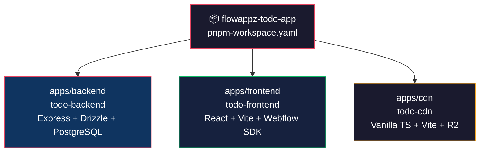

### Why a monorepo?

| Benefit | How |
|---------|-----|
| **Shared TypeScript** | Root `typescript` dependency, shared `tsconfig` patterns |
| **Single install** | `pnpm install` at root installs all three apps |
| **Unified scripts** | `pnpm dev:backend`, `pnpm dev:frontend`, `pnpm dev:cdn` from root |
| **Independent deploys** | Each app has its own `build` script and deployment target |

### Key files at root level:

- [pnpm-workspace.yaml](file:///c:/Users/User/OneDrive/Desktop/todo-app/pnpm-workspace.yaml) — declares `apps/*` as workspace packages
- [package.json](file:///c:/Users/User/OneDrive/Desktop/todo-app/package.json) — root orchestration scripts
- [readme.md](file:///c:/Users/User/OneDrive/Desktop/todo-app/readme.md) — project overview

---

## 3. The Three Pillars — How They Connect

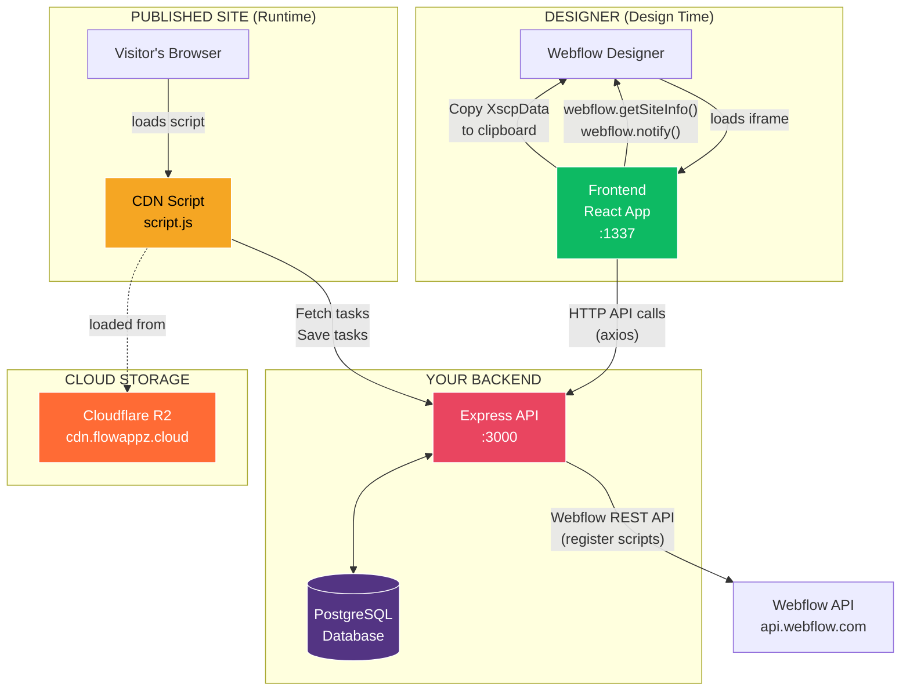

### The data contracts between the three pillars:

| From → To | Protocol | Key Endpoints |
|-----------|----------|---------------|
| **Frontend → Backend** | HTTP (axios) | `/api/sites/validate`, `/api/todo/settings`, `/api/todo/tasks`, `/api/webflow/*` |
| **CDN → Backend** | HTTP (fetch) | `/api/todo/tasks` (GET + PUT) |
| **Backend → Webflow API** | HTTP (webflow-api SDK) | OAuth, register scripts, inject custom code |
| **Frontend → Webflow Designer** | JS SDK (`webflow` global) | `getSiteInfo()`, `notify()`, clipboard paste |
| **Upload Script → R2** | AWS S3 SDK | Upload `script.js` to versioned path |
| **Upload Script → Backend** | HTTP (fetch) | `POST /api/webflow/cdn-release` |

---

## 4. Complete Request Flow Diagrams

### 4A. The Full App Lifecycle — From Install to Published Page

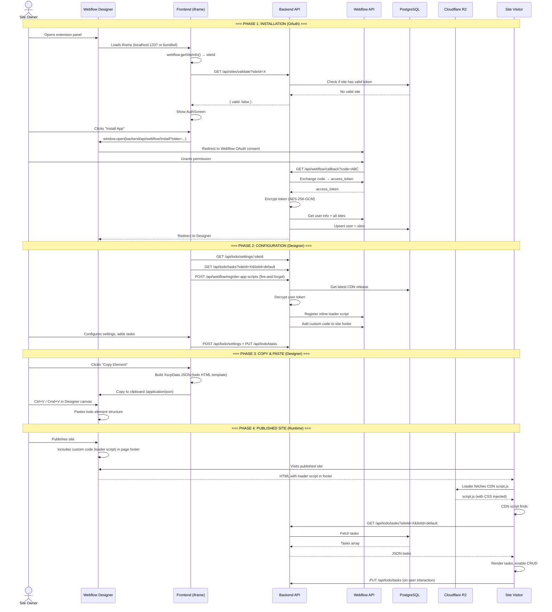

### 4B. OAuth Flow (Detailed)

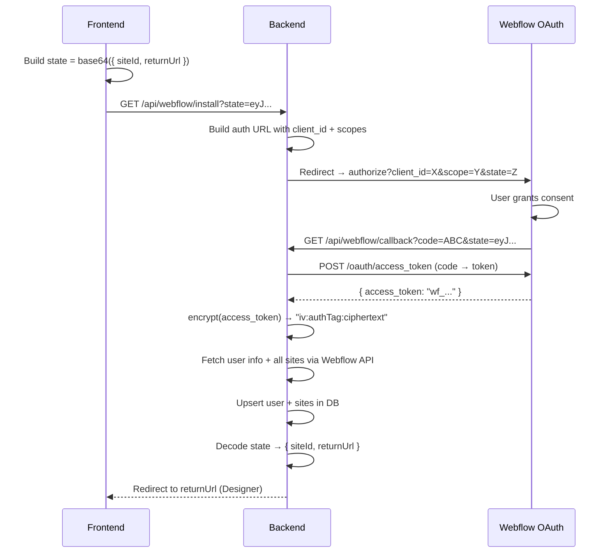

> [!NOTE]
> The `state` parameter is a base64-encoded JSON containing `{ siteId, returnUrl }`. This is an OAuth standard practice — it lets the callback know which site initiated the auth and where to redirect after completion.

### 4C. CDN Script Injection Flow

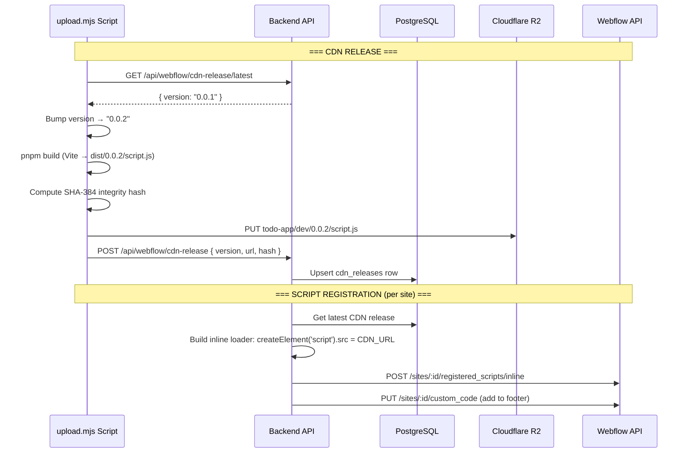

> [!IMPORTANT]
> The CDN script is NOT loaded directly via `<script src="...">` in the page HTML. Instead, Webflow's **Custom Code** system injects a small **inline loader script** into the site footer, which dynamically creates a `<script>` element pointing to your CDN URL. This is the standard Webflow pattern for app scripts.

---

## 5. Backend Deep Dive

### 5A. Architecture Layers

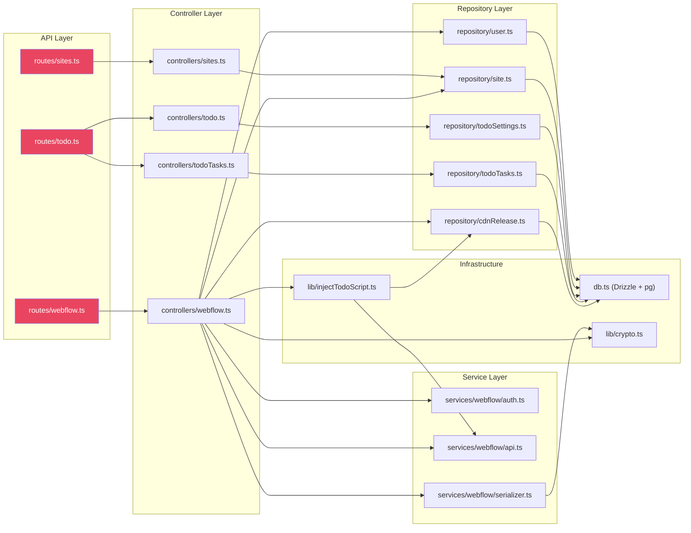

### 5B. Database Schema

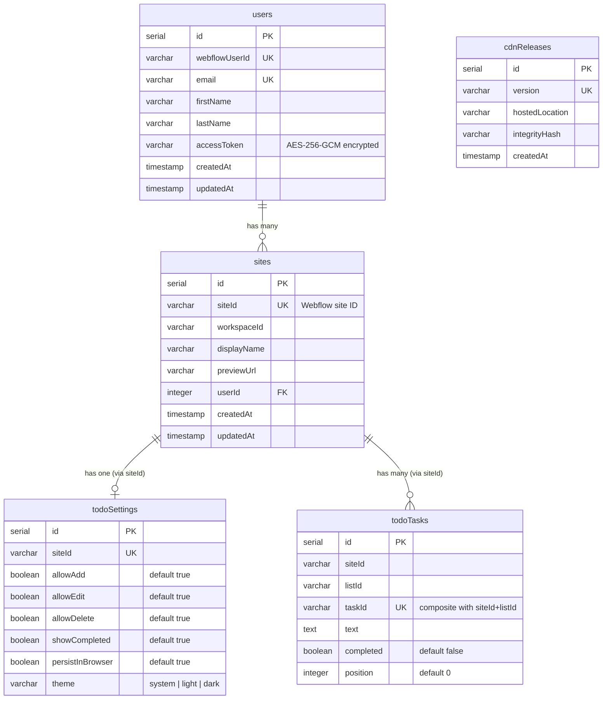

### 5C. Token Security Flow

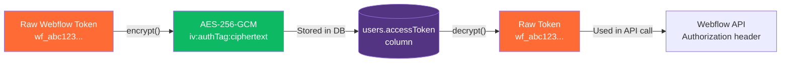

**How encryption works** in [lib/crypto.ts](file:///c:/Users/User/OneDrive/Desktop/todo-app/apps/backend/src/lib/crypto.ts):
- **Algorithm**: AES-256-GCM (authenticated encryption)
- **Key**: SHA-256 hash of `ENCRYPTION_SECRET` env var → 32-byte key
- **Encrypt**: Random 12-byte IV + GCM auth tag → stored as `iv:authTag:ciphertext` (hex, colon-separated)
- **Decrypt**: Splits on `:`, reconstructs GCM decipher → returns original token
- **Backward compat**: If no colons found, returns value as-is (for old plaintext tokens)

### 5D. Every API Route

| Method | Route | Controller | Purpose |
|--------|-------|------------|---------|
| GET | `/api/health` | inline | Health check |
| GET | `/api/sites/validate` | `sites.validateSite` | Check if site is authenticated |
| GET | `/api/webflow/install` | inline redirect | Start OAuth flow |
| GET | `/api/webflow/callback` | `webflow.handleAuthorizationCallback` | OAuth callback |
| GET | `/api/webflow/sites` | `webflow.getSiteByWebflowId` | Get site by Webflow ID |
| DELETE | `/api/webflow/sites` | `webflow.logout` | Clear access token |
| POST | `/api/webflow/register-app-scripts` | `webflow.registerCustomScript` | Inject CDN script into site |
| POST | `/api/webflow/register-all-scripts` | `webflow.registerAllSites` | Inject CDN script into ALL sites |
| GET | `/api/webflow/cdn-release/latest` | `webflow.getLatestRelease` | Latest CDN version |
| POST | `/api/webflow/cdn-release` | `webflow.saveCdnRelease` | Register new CDN release |
| GET | `/api/todo/settings/:siteId` | `todo.getSettings` | Get site settings |
| POST | `/api/todo/settings` | `todo.saveSettings` | Upsert site settings |
| GET | `/api/todo/tasks` | `todoTasks.getTasks` | Get tasks for site/list |
| PUT | `/api/todo/tasks` | `todoTasks.replaceTasks` | Bulk replace all tasks |
| POST | `/api/todo/tasks` | `todoTasks.createTask` | Create single task |
| PATCH | `/api/todo/tasks/:taskId` | `todoTasks.updateTask` | Update single task |
| DELETE | `/api/todo/tasks/:taskId` | `todoTasks.deleteTask` | Delete single task |

### 5E. CORS Configuration

The backend allows requests from:
- `FRONTEND_URL` (e.g., `http://localhost:1337`)
- Any origins in `ALLOWED_ORIGINS` (comma-separated)
- Hardcoded: `http://localhost:1337`, `http://localhost:5173`
- **Dynamic**: Any `*.webflow.com` or `*.webflow.io` hostname — this is critical because the Designer Extension iframe runs from a Webflow subdomain

---

## 6. Frontend Deep Dive

### 6A. The Extension Architecture

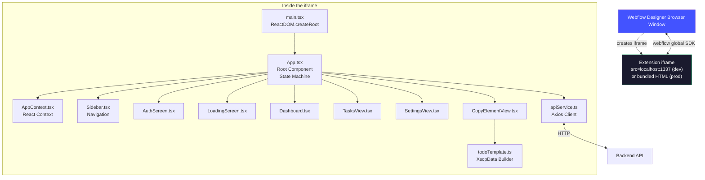

### 6B. App State Machine

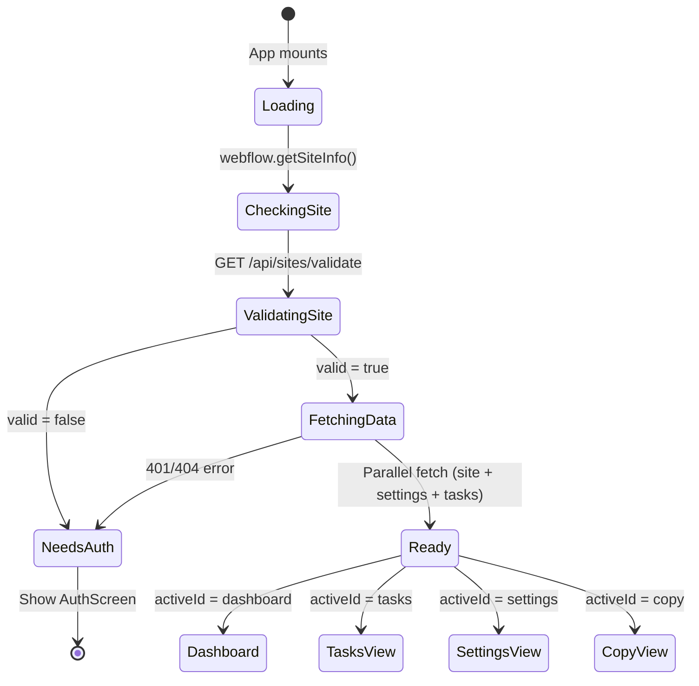

### 6C. The Copy-to-Clipboard Magic (Most Important Feature)

This is the core mechanism that bridges your extension with the Webflow Designer canvas:

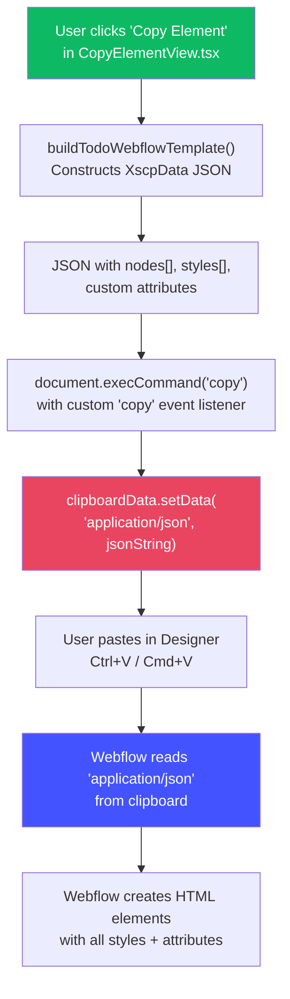

> [!IMPORTANT]
> **Why `document.execCommand('copy')` and not `navigator.clipboard.writeText()`?**
> Webflow's paste handler reads the `application/json` MIME type from the synchronous `ClipboardEvent.clipboardData`. The async Clipboard API doesn't support custom MIME types in the same way. This is a critical Webflow-specific pattern.

**What gets pasted** — the [todoTemplate.ts](file:///c:/Users/User/OneDrive/Desktop/todo-app/apps/frontend/src/templates/todoTemplate.ts) file builds this HTML structure:

```
flowappz-todo-root (div, container)                    ← Custom attrs: theme, permissions
├── flowappz-todo-header (flex row)
│   └── flowappz-todo-title (h2: "Todo List")
├── flowappz-todo-form (flex row)
│   ├── flowappz-todo-input (text input)
│   └── flowappz-todo-add-button (submit button)
├── flowappz-todo-list (flex column)
│   └── [for each task]:
│       flowappz-todo-item (flex row)                  ← First item = template for CDN
│       ├── flowappz-todo-checkbox (checkbox)
│       ├── flowappz-todo-text (div with text)
│       └── flowappz-todo-delete (button)
└── flowappz-todo-empty (hidden: "No tasks yet.")
```

Each element carries **custom attributes** (like `flowappz-todo-allow-add="true"`) that the CDN runtime script reads to know what features to enable.

### 6D. Build Pipeline (5 Steps)

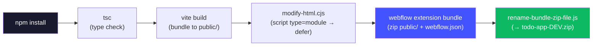

> [!NOTE]
> The `modify-html.cjs` step is essential — Webflow's extension iframe doesn't support ES module `<script>` tags, so `type="module" crossorigin` is replaced with `defer`.

### 6E. Webflow Designer SDK Usage

Your extension uses two key APIs from the `webflow` global object:

| API | Where Used | Purpose |
|-----|-----------|---------|
| `webflow.getSiteInfo()` | [App.tsx](file:///c:/Users/User/OneDrive/Desktop/todo-app/apps/frontend/src/App.tsx) | Get current site's `siteId` and `shortName` |
| `webflow.notify()` | [CopyElementView.tsx](file:///c:/Users/User/OneDrive/Desktop/todo-app/apps/frontend/src/views/CopyElementView.tsx) | Show toast notifications in Designer |

The `@webflow/designer-extension-typings` package provides TypeScript types for this global.

---

## 7. CDN Deep Dive

### 7A. What the CDN Script Does

The [script.ts](file:///c:/Users/User/OneDrive/Desktop/todo-app/apps/cdn/src/script.ts) is a **self-contained, framework-free** JavaScript file that runs on published Webflow pages.

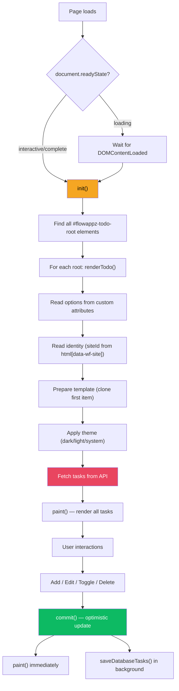

### 7B. How the CDN Script Connects to Pasted HTML

The CDN script uses **element IDs and custom attributes** as a contract with the pasted HTML from the Designer Extension:

| Selector / Attribute | Purpose |
|----------------------|---------|
| `#flowappz-todo-root` | Root container — script entry point |
| `#flowappz-todo-form` | Add-task form |
| `#flowappz-todo-input` | Text input field |
| `#flowappz-todo-add-button` | Submit button |
| `#flowappz-todo-list` | Task list container |
| `#flowappz-todo-empty` | Empty state message |
| `#flowappz-todo-item-template` | First task item, used as clone template |
| `[flowappz-todo-item="true"]` | Identifies task items |
| `[flowappz-todo-checkbox="true"]` | Identifies checkboxes |
| `flowappz-todo-allow-add` | Permission attribute on root |
| `flowappz-todo-theme` | Theme attribute on root |
| `html[data-wf-site]` | Webflow's own site ID (read by CDN) |

> [!TIP]
> This attribute-based contract is a powerful pattern. The Designer Extension configures behavior through HTML attributes, and the CDN script reads them at runtime. No server round-trip needed for configuration!

### 7C. Optimistic Updates Pattern

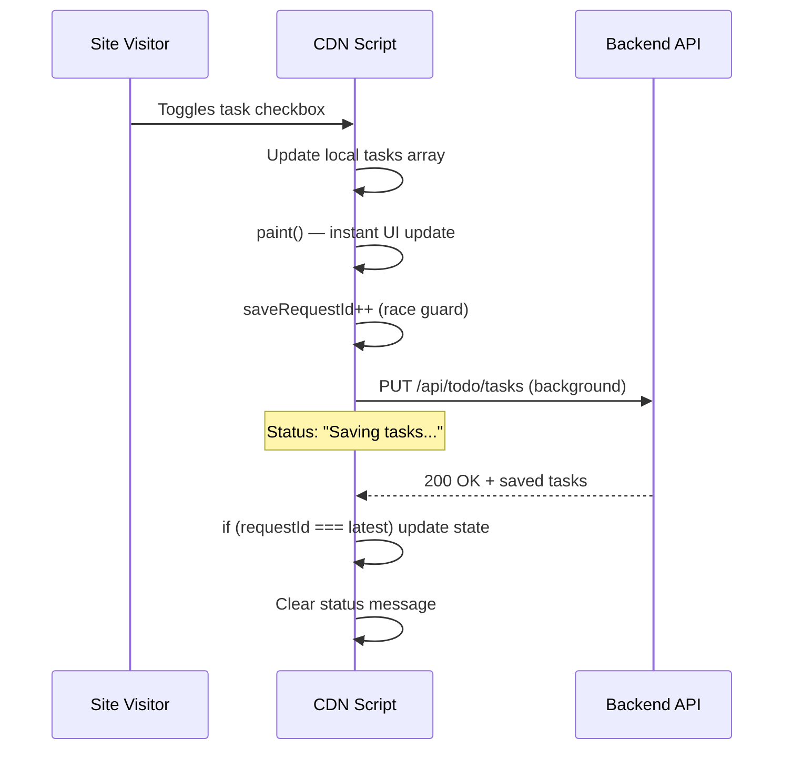

### 7D. Versioning & Release Flow

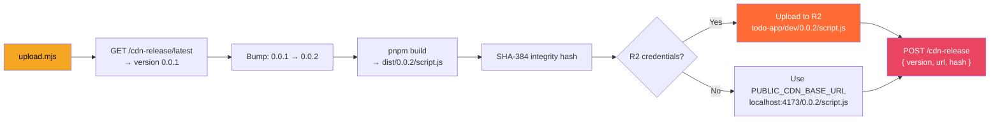

### 7E. CSS Injection — No Separate CSS File

The [vite.config.ts](file:///c:/Users/User/OneDrive/Desktop/todo-app/apps/cdn/vite.config.ts) uses `vite-plugin-css-injected-by-js` which **bundles CSS directly into the JavaScript**. At runtime, the JS injects a `<style>` tag into the page's `<head>`.

**Why?** Only ONE file (`script.js`) needs to be hosted and loaded. No separate CSS request = faster loading and simpler deployment.

---

## 8. Local Development Flow

### 8A. What Runs Where

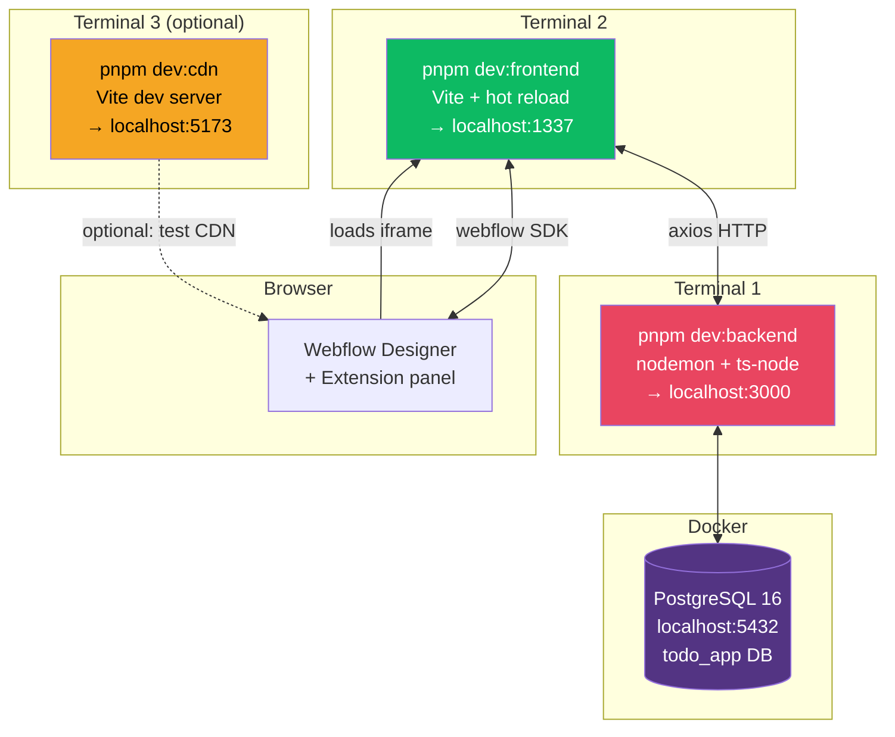

### 8B. Setup Checklist

| Step | Command | What Happens |
|------|---------|--------------|
| 1 | `pnpm install` | Install all dependencies for all 3 apps |
| 2 | `pnpm docker:up` (in apps/backend) | Start PostgreSQL container |
| 3 | Copy `.env.example` → `.env` for each app | Configure secrets |
| 4 | `pnpm db:push` | Push Drizzle schema to database |
| 5 | `pnpm dev:backend` | Start Express API on :3000 |
| 6 | `pnpm dev:frontend` | Start Vite dev server on :1337 |
| 7 | Open Webflow Designer | Configure app dev URL to :1337 |

### 8C. Hot Reload in Development

The frontend uses `@xatom/wf-app-hot-reload` — a Vite plugin that sends WebSocket messages to refresh the extension iframe inside Webflow Designer whenever you save a file. This means you get near-instant feedback without manually refreshing.

---

## 9. Production Deployment Flow

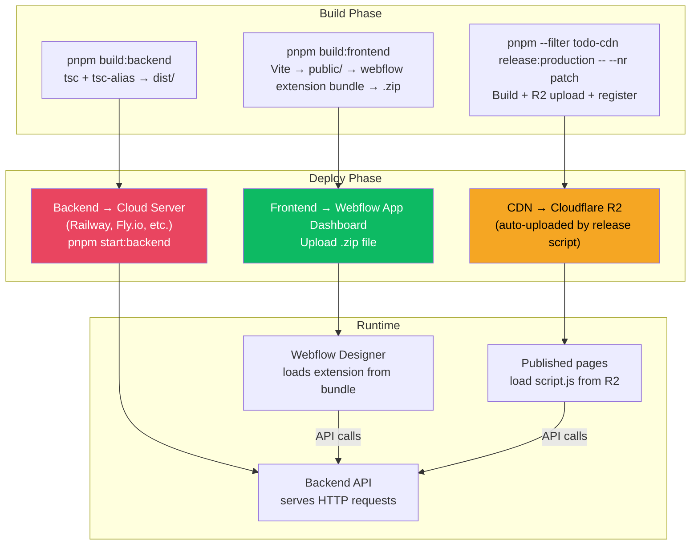

### Production vs Local — Key Differences

| Aspect | Local Development | Production |
|--------|-------------------|------------|
| **Backend** | `nodemon` with ts-node, auto-restart | Compiled JS from `dist/`, `node dist/index.js` |
| **Frontend** | Vite dev server on :1337, hot reload | Bundled `.zip`, uploaded to Webflow marketplace |
| **CDN Script** | Optional `vite preview` on :4173 | Hosted on Cloudflare R2, served via CDN |
| **Database** | Docker PostgreSQL locally | Managed PostgreSQL (e.g., Supabase, Neon) |
| **OAuth redirect** | `localhost:3000/api/webflow/callback` | `yourdomain.com/api/webflow/callback` |
| **CORS** | Allows localhost origins | Allows production + webflow.com domains |
| **Tokens** | Encrypted same way | Encrypted same way |

---

## 10. Universal Webflow App Principles

> [!CAUTION]
> These are the essential patterns and requirements that EVERY Webflow app must follow — not just your todo app. Master these and you can build any Webflow app.

### Principle 1: The Two-World Architecture

Every Webflow app that affects published pages needs both:
- A **Designer Extension** (React iframe in the Designer sidebar) for configuration
- A **CDN Runtime Script** (vanilla JS loaded on published pages) for functionality

They communicate through your backend and through HTML attributes on pasted elements.

### Principle 2: OAuth is Mandatory

Webflow requires OAuth 2.0 for any app accessing site data. Your flow must:
1. Register your app in the Webflow dashboard with correct redirect URIs and scopes
2. Implement the authorization code flow (redirect → consent → callback → token exchange)
3. **Encrypt and securely store** access tokens (never store plaintext tokens)
4. Handle token refresh/expiration gracefully

### Principle 3: The Copy-Paste Contract

To inject your UI into the Webflow Designer canvas, you must:
1. Build an `@webflow/XscpData` JSON payload (Webflow's clipboard format)
2. Copy it to clipboard using `document.execCommand('copy')` with `application/json` MIME type
3. Your pasted elements carry **custom attributes** that your CDN script reads at runtime
4. Use stable, namespaced IDs and attribute names (e.g., `flowappz-todo-*`)

### Principle 4: CDN Script Injection via Custom Code

To get your script running on published pages:
1. Register an **inline loader script** via the Webflow API (`POST /sites/:id/registered_scripts/inline`)
2. Add it to the site's **custom code footer** (`PUT /sites/:id/custom_code`)
3. The loader dynamically creates a `<script>` element pointing to your CDN-hosted script
4. Version your CDN scripts and track releases in your database

### Principle 5: Attribute-Based Configuration

Instead of making API calls to fetch configuration on every page load, bake settings into HTML attributes:
- The Designer Extension writes settings as custom attributes on pasted elements
- The CDN script reads these attributes at runtime
- This reduces API calls and improves published page performance

### Principle 6: Extension iframe Constraints

- The extension runs in an `<iframe>` inside the Webflow Designer
- **No ES modules** — build output must use `defer` scripts, not `type="module"`
- Use the `webflow` global SDK for Designer integration (site info, notifications)
- Match the Designer's dark theme aesthetic for consistency
- Bundle size matters — keep the extension lightweight

### Principle 7: Graceful Degradation

- CDN script should **fall back** to reading HTML content if the API fails
- Use optimistic updates for responsiveness
- Handle race conditions in async saves (save request ID pattern)
- Show clear status messages during loading/saving/errors

### Principle 8: Security Essentials

| What | How |
|------|-----|
| Token storage | AES-256-GCM encryption at rest |
| CORS | Whitelist specific origins + dynamic `*.webflow.com` |
| API validation | Validate `siteId` ownership before returning data |
| CDN integrity | SHA-384 Subresource Integrity hash |
| Environment secrets | `.env` files, never committed to git |

### Principle 9: Versioned CDN Releases

- Version every CDN build (`dist/<version>/script.js`)
- Track releases in your database with version, URL, and integrity hash
- Keep old versions available (don't delete `emptyOutDir: false`)
- Separate release flows for dev/staging/production environments

### Principle 10: The Webflow API Surface

Key Webflow API endpoints every app developer should know:

| Endpoint | Purpose |
|----------|---------|
| `POST /oauth/access_token` | Exchange auth code for access token |
| `GET /token/authorized_by` | Get authenticated user info |
| `GET /sites` / `GET /sites/:id` | List/get sites |
| `POST /sites/:id/registered_scripts/inline` | Register a script for a site |
| `GET /sites/:id/custom_code` | Get site's custom code entries |
| `PUT /sites/:id/custom_code` | Update site's custom code (inject your script) |

---

## 11. File Map — Every File & Its Purpose

### Root

| File | Purpose |
|------|---------|
| [package.json](file:///c:/Users/User/OneDrive/Desktop/todo-app/package.json) | Root workspace scripts |
| [pnpm-workspace.yaml](file:///c:/Users/User/OneDrive/Desktop/todo-app/pnpm-workspace.yaml) | Declares `apps/*` as workspace packages |
| [readme.md](file:///c:/Users/User/OneDrive/Desktop/todo-app/readme.md) | Project overview |
| [wiki/local-setup.md](file:///c:/Users/User/OneDrive/Desktop/todo-app/wiki/local-setup.md) | Detailed local setup guide |

---

### Backend (`apps/backend/`)

| File | Purpose |
|------|---------|
| [package.json](file:///c:/Users/User/OneDrive/Desktop/todo-app/apps/backend/package.json) | Dependencies & scripts (dev, build, db commands) |
| [tsconfig.json](file:///c:/Users/User/OneDrive/Desktop/todo-app/apps/backend/tsconfig.json) | TypeScript config with `@/*` path alias |
| [drizzle.config.ts](file:///c:/Users/User/OneDrive/Desktop/todo-app/apps/backend/drizzle.config.ts) | Drizzle ORM config (schema path, DB URL) |
| [docker-compose.dev.yml](file:///c:/Users/User/OneDrive/Desktop/todo-app/apps/backend/docker-compose.dev.yml) | PostgreSQL 16 container for local dev |
| [src/index.ts](file:///c:/Users/User/OneDrive/Desktop/todo-app/apps/backend/src/index.ts) | Express server entry — CORS, body parsing, routes |
| [src/db.ts](file:///c:/Users/User/OneDrive/Desktop/todo-app/apps/backend/src/db.ts) | Drizzle + pg Pool initialization |
| [src/db/schema.ts](file:///c:/Users/User/OneDrive/Desktop/todo-app/apps/backend/src/db/schema.ts) | All 5 database tables + relations |
| [src/api/index.ts](file:///c:/Users/User/OneDrive/Desktop/todo-app/apps/backend/src/api/index.ts) | API router — mounts sub-routes |
| [src/api/sites.ts](file:///c:/Users/User/OneDrive/Desktop/todo-app/apps/backend/src/api/sites.ts) | Site validation route |
| [src/api/todo.ts](file:///c:/Users/User/OneDrive/Desktop/todo-app/apps/backend/src/api/todo.ts) | Todo settings + tasks routes |
| [src/api/webflow.ts](file:///c:/Users/User/OneDrive/Desktop/todo-app/apps/backend/src/api/webflow.ts) | OAuth, CDN release, script registration routes |
| [src/controllers/sites.ts](file:///c:/Users/User/OneDrive/Desktop/todo-app/apps/backend/src/controllers/sites.ts) | Site validation logic |
| [src/controllers/todo.ts](file:///c:/Users/User/OneDrive/Desktop/todo-app/apps/backend/src/controllers/todo.ts) | Settings CRUD logic |
| [src/controllers/todoTasks.ts](file:///c:/Users/User/OneDrive/Desktop/todo-app/apps/backend/src/controllers/todoTasks.ts) | Tasks CRUD logic (normalize, serialize, bulk replace) |
| [src/controllers/webflow.ts](file:///c:/Users/User/OneDrive/Desktop/todo-app/apps/backend/src/controllers/webflow.ts) | OAuth callback, script injection, CDN release, logout |
| [src/repository/user.ts](file:///c:/Users/User/OneDrive/Desktop/todo-app/apps/backend/src/repository/user.ts) | User upsert + token clearing |
| [src/repository/site.ts](file:///c:/Users/User/OneDrive/Desktop/todo-app/apps/backend/src/repository/site.ts) | Site lookup, validation, deletion |
| [src/repository/todoSettings.ts](file:///c:/Users/User/OneDrive/Desktop/todo-app/apps/backend/src/repository/todoSettings.ts) | Settings upsert + lookup |
| [src/repository/todoTasks.ts](file:///c:/Users/User/OneDrive/Desktop/todo-app/apps/backend/src/repository/todoTasks.ts) | Task CRUD with transactions |
| [src/repository/cdnRelease.ts](file:///c:/Users/User/OneDrive/Desktop/todo-app/apps/backend/src/repository/cdnRelease.ts) | CDN release upsert + latest lookup |
| [src/services/webflow/auth.ts](file:///c:/Users/User/OneDrive/Desktop/todo-app/apps/backend/src/services/webflow/auth.ts) | Webflow OAuth client + token exchange |
| [src/services/webflow/api.ts](file:///c:/Users/User/OneDrive/Desktop/todo-app/apps/backend/src/services/webflow/api.ts) | WebflowApiClient class (SDK wrapper) |
| [src/services/webflow/serializer.ts](file:///c:/Users/User/OneDrive/Desktop/todo-app/apps/backend/src/services/webflow/serializer.ts) | Map Webflow API responses → DB format |
| [src/lib/crypto.ts](file:///c:/Users/User/OneDrive/Desktop/todo-app/apps/backend/src/lib/crypto.ts) | AES-256-GCM encrypt/decrypt for tokens |
| [src/lib/injectTodoScript.ts](file:///c:/Users/User/OneDrive/Desktop/todo-app/apps/backend/src/lib/injectTodoScript.ts) | Build + register + inject CDN loader script |
| [src/config/scripts.ts](file:///c:/Users/User/OneDrive/Desktop/todo-app/apps/backend/src/config/scripts.ts) | Script display name constant |
| [src/constants/todo.ts](file:///c:/Users/User/OneDrive/Desktop/todo-app/apps/backend/src/constants/todo.ts) | DEFAULT_LIST_ID = "default" |
| [scripts/migrate-initial-tasks.ts](file:///c:/Users/User/OneDrive/Desktop/todo-app/apps/backend/scripts/migrate-initial-tasks.ts) | One-time migration script |

---

### Frontend (`apps/frontend/`)

| File | Purpose |
|------|---------|
| [package.json](file:///c:/Users/User/OneDrive/Desktop/todo-app/apps/frontend/package.json) | Dependencies & build pipeline scripts |
| [webflow.json](file:///c:/Users/User/OneDrive/Desktop/todo-app/apps/frontend/webflow.json) | Webflow extension manifest (name, size) |
| [vite.config.ts](file:///c:/Users/User/OneDrive/Desktop/todo-app/apps/frontend/vite.config.ts) | Production Vite build config |
| [vite-dev.config.mjs](file:///c:/Users/User/OneDrive/Desktop/todo-app/apps/frontend/vite-dev.config.mjs) | Dev server config with hot reload plugin |
| [index.html](file:///c:/Users/User/OneDrive/Desktop/todo-app/apps/frontend/index.html) | Vite entry HTML |
| [tailwind.config.cjs](file:///c:/Users/User/OneDrive/Desktop/todo-app/apps/frontend/tailwind.config.cjs) | Tailwind + Inter font |
| [postcss.config.cjs](file:///c:/Users/User/OneDrive/Desktop/todo-app/apps/frontend/postcss.config.cjs) | PostCSS pipeline |
| [src/main.tsx](file:///c:/Users/User/OneDrive/Desktop/todo-app/apps/frontend/src/main.tsx) | React entry point |
| [src/App.tsx](file:///c:/Users/User/OneDrive/Desktop/todo-app/apps/frontend/src/App.tsx) | Root component — state machine, routing, init |
| [src/index.css](file:///c:/Users/User/OneDrive/Desktop/todo-app/apps/frontend/src/index.css) | Global CSS with Tailwind directives |
| [src/types.ts](file:///c:/Users/User/OneDrive/Desktop/todo-app/apps/frontend/src/types.ts) | Shared TypeScript types |
| [src/vite-env.d.ts](file:///c:/Users/User/OneDrive/Desktop/todo-app/apps/frontend/src/vite-env.d.ts) | Webflow global type augmentation |
| [src/modify-html.cjs](file:///c:/Users/User/OneDrive/Desktop/todo-app/apps/frontend/src/modify-html.cjs) | Post-build: module → defer script tags |
| [src/contexts/AppContext.tsx](file:///c:/Users/User/OneDrive/Desktop/todo-app/apps/frontend/src/contexts/AppContext.tsx) | React Context for global state |
| [src/components/Sidebar.tsx](file:///c:/Users/User/OneDrive/Desktop/todo-app/apps/frontend/src/components/Sidebar.tsx) | Navigation sidebar with icons |
| [src/components/Toggle.tsx](file:///c:/Users/User/OneDrive/Desktop/todo-app/apps/frontend/src/components/Toggle.tsx) | Reusable toggle checkbox |
| [src/services/apiService.ts](file:///c:/Users/User/OneDrive/Desktop/todo-app/apps/frontend/src/services/apiService.ts) | Axios client — all backend API calls |
| [src/templates/todoTemplate.ts](file:///c:/Users/User/OneDrive/Desktop/todo-app/apps/frontend/src/templates/todoTemplate.ts) | XscpData payload builder (360 lines) |
| [src/utils/tasks.ts](file:///c:/Users/User/OneDrive/Desktop/todo-app/apps/frontend/src/utils/tasks.ts) | Task normalization from API |
| [src/constants/todo.ts](file:///c:/Users/User/OneDrive/Desktop/todo-app/apps/frontend/src/constants/todo.ts) | DEFAULT_LIST_ID = "default" |
| [src/views/AuthScreen.tsx](file:///c:/Users/User/OneDrive/Desktop/todo-app/apps/frontend/src/views/AuthScreen.tsx) | OAuth initiation screen |
| [src/views/Dashboard.tsx](file:///c:/Users/User/OneDrive/Desktop/todo-app/apps/frontend/src/views/Dashboard.tsx) | Home screen with stats |
| [src/views/TasksView.tsx](file:///c:/Users/User/OneDrive/Desktop/todo-app/apps/frontend/src/views/TasksView.tsx) | Task CRUD interface |
| [src/views/SettingsView.tsx](file:///c:/Users/User/OneDrive/Desktop/todo-app/apps/frontend/src/views/SettingsView.tsx) | Settings toggles |
| [src/views/CopyElementView.tsx](file:///c:/Users/User/OneDrive/Desktop/todo-app/apps/frontend/src/views/CopyElementView.tsx) | Copy-to-clipboard for Designer paste |
| [src/views/LoadingScreen.tsx](file:///c:/Users/User/OneDrive/Desktop/todo-app/apps/frontend/src/views/LoadingScreen.tsx) | Loading spinner |
| [cmd/rename-bundle-zip-file.js](file:///c:/Users/User/OneDrive/Desktop/todo-app/apps/frontend/cmd/rename-bundle-zip-file.js) | Post-build zip renamer |

---

### CDN (`apps/cdn/`)

| File | Purpose |
|------|---------|
| [package.json](file:///c:/Users/User/OneDrive/Desktop/todo-app/apps/cdn/package.json) | Dependencies & release scripts |
| [vite.config.ts](file:///c:/Users/User/OneDrive/Desktop/todo-app/apps/cdn/vite.config.ts) | Build config — CSS-in-JS, versioned output |
| [tsconfig.json](file:///c:/Users/User/OneDrive/Desktop/todo-app/apps/cdn/tsconfig.json) | TypeScript config |
| [src/script.ts](file:///c:/Users/User/OneDrive/Desktop/todo-app/apps/cdn/src/script.ts) | Main runtime — 388 lines, full todo CRUD on published pages |
| [src/style.css](file:///c:/Users/User/OneDrive/Desktop/todo-app/apps/cdn/src/style.css) | Dark theme + focus styles (injected by JS) |
| [src/vite-env.d.ts](file:///c:/Users/User/OneDrive/Desktop/todo-app/apps/cdn/src/vite-env.d.ts) | Compile-time constant types |
| [scripts/upload.mjs](file:///c:/Users/User/OneDrive/Desktop/todo-app/apps/cdn/scripts/upload.mjs) | Build + version bump + R2 upload + release registration |

---

## 🎯 Quick Reference: How Things Connect

````carousel
### Frontend → Backend
```
apiService.ts uses axios to call:
  GET  /api/sites/validate        → Check auth
  GET  /api/webflow/sites         → Get site data
  POST /api/webflow/register-app-scripts → Inject CDN
  GET  /api/todo/settings/:siteId → Load settings
  POST /api/todo/settings         → Save settings
  GET  /api/todo/tasks            → Load tasks
  PUT  /api/todo/tasks            → Save tasks
```
<!-- slide -->
### CDN → Backend
```
script.ts uses fetch() to call:
  GET /api/todo/tasks?siteId=X&listId=Y  → Load tasks
  PUT /api/todo/tasks                     → Save tasks
```
<!-- slide -->
### Frontend → Webflow Designer
```
App.tsx:     webflow.getSiteInfo()   → Get siteId
CopyView:    webflow.notify()        → Show toasts
CopyView:    clipboardData.setData() → Paste elements
```
<!-- slide -->
### Backend → Webflow API
```
auth.ts:    POST /oauth/access_token       → Exchange code
api.ts:     GET  /token/authorized_by      → User info
api.ts:     GET  /sites                    → List sites
api.ts:     POST /sites/:id/registered_scripts/inline → Register script
api.ts:     PUT  /sites/:id/custom_code    → Inject custom code
```
<!-- slide -->
### Upload Script → Backend + R2
```
upload.mjs:
  GET  /api/webflow/cdn-release/latest → Get current version
  POST /api/webflow/cdn-release        → Register new release
  PUT  R2 bucket                       → Upload script.js
```
````

---

> [!TIP]
> **Your next step**: Build something more complex! Now that you understand the three-pillar architecture, OAuth flow, XscpData clipboard format, and CDN script injection pattern, you have the foundational knowledge to build any Webflow app — whether it's an analytics dashboard, a form builder, a CMS plugin, or an e-commerce tool. The patterns are the same; only the business logic changes.
